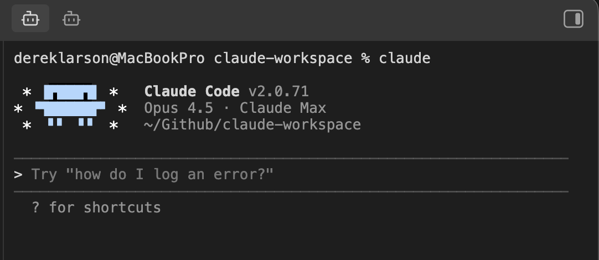

# Claude Sidebar

Run [Claude Code](https://claude.com/claude-code) in your Obsidian sidebar.



## Features

- **Embedded terminal** - Full terminal in your Obsidian sidebar
- **Auto-launches Claude** - Claude Code starts automatically
- **Multiple tabs** - Run multiple Claude instances side by side

## Requirements

- macOS, Linux, or Windows
- Python 3
- [Claude Code](https://claude.com/claude-code)

## Installation

### Quick Install (curl)

In your vault folder, run:
```bash
curl -sL https://github.com/derek-larson14/obsidian-claude-sidebar/archive/refs/heads/main.tar.gz | tar -xz -C .obsidian/plugins && mv .obsidian/plugins/obsidian-claude-sidebar-main .obsidian/plugins/claude-sidebar
```

Then in Obsidian: Settings → Community Plugins → Refresh → Enable "Claude Sidebar"

### Manual Installation

1. Download `main.js`, `manifest.json`, and `styles.css` from the [latest release](https://github.com/derek-larson14/obsidian-claude-sidebar/releases)
2. Create folder: `<your-vault>/.obsidian/plugins/claude-sidebar/`
3. Copy the downloaded files into that folder
4. Reload Obsidian and enable the plugin in Settings → Community Plugins

### From Community Plugins

Once approved, you'll be able to search for "Claude Sidebar" in Community Plugins → Browse.

## Updating

In your vault folder, run:
```bash
cd .obsidian/plugins/claude-sidebar
curl -LO https://github.com/derek-larson14/obsidian-claude-sidebar/releases/latest/download/main.js
curl -LO https://github.com/derek-larson14/obsidian-claude-sidebar/releases/latest/download/manifest.json
```

Then restart Obsidian or disable/re-enable the plugin.

## Usage

- Click the bot icon in the left ribbon to open Claude
- Use Command Palette (`Cmd+P`) for:
  - **Open Claude Code** - Open or focus Claude panel
  - **New Claude Tab** - Open additional Claude instance
  - **Close Claude Tab** - Close current Claude tab (when focused)
  - **Toggle Focus: Editor ↔ Claude** - Quick switch between editor and Claude
- Press `Shift+Enter` for multi-line input
- Set your own hotkeys in Settings → Hotkeys

## Platform Support

| Platform | Status |
|----------|--------|
| macOS | ✅ Supported |
| Linux | ✅ Supported |
| Windows | ⚠️ Experimental |

### Windows Setup (Experimental)

Windows requires additional dependencies:

1. Install Python 3 from [python.org](https://python.org)
2. Install pywinpty:
```bash
pip install pywinpty
```

3. Install the plugin (run from your vault folder in PowerShell):
```powershell
$u="https://github.com/derek-larson14/obsidian-claude-sidebar/archive/main.zip"; Invoke-WebRequest $u -OutFile s.zip; Expand-Archive s.zip .obsidian\plugins -Force; Move-Item ".obsidian\plugins\obsidian-claude-sidebar-main" ".obsidian\plugins\claude-sidebar" -Force; Remove-Item s.zip
```

**Note:** Windows support is experimental. Performance may be slower than macOS/Linux due to ConPTY overhead.

## How It Works

- [xterm.js](https://xtermjs.org/) for terminal emulation
- Python's built-in `pty` module for pseudo-terminal support (macOS/Linux)
- [pywinpty](https://github.com/andfoy/pywinpty) for Windows PTY support

## Development

The PTY scripts (`terminal_pty.py` for Unix, `terminal_win.py` for Windows) are embedded as base64 in `main.js` for Obsidian plugin directory compatibility. To rebuild after modifying:

```bash
./build.sh
```

## Contributing

Issues and PRs welcome at [github.com/derek-larson14/obsidian-claude-sidebar](https://github.com/derek-larson14/obsidian-claude-sidebar)

## Author

Built by [Derek Larson](https://dtlarson.com). Want to get more out of Claude Code? See [Delegate with Claude](https://delegatewithclaude.com).

## License

MIT
