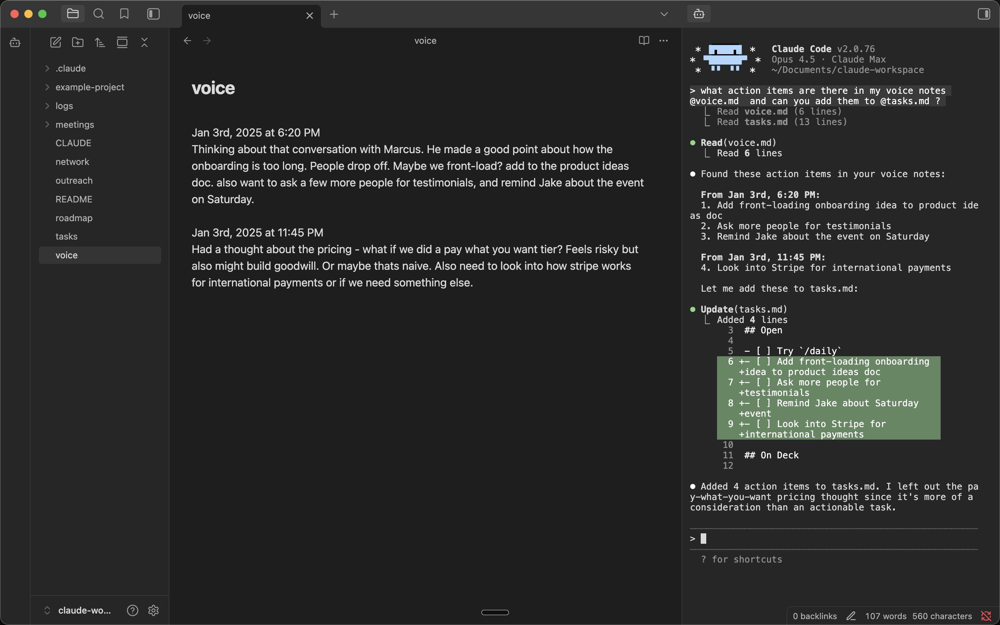

# Vault Code

Run [Claude Code](https://claude.com/claude-code) in your Obsidian sidebar with automatic Obsidian context sharing.



## Features

- **Embedded terminal** – Full terminal in your Obsidian sidebar
- **Auto-launches Claude** - Claude Code starts automatically
- **Multiple tabs** – Run multiple Claude instances side by side
- **Obsidian → Claude Code integration** (optional) – Claude Code gets the current context from Obsidian (open file, selected lines) automatically over `/ide` MCP integration (inspired by Claude Code plugin for Intellij IDEA) 

## Requirements

- macOS, Linux, or Windows
- Python 3
- [Claude Code](https://claude.com/claude-code)

## Installation

### Quick Install (Mac/Linux)

In your vault folder, run:
```bash
curl -fsSL https://github.com/hlibkoval/vault-code/releases/latest/download/vault-code.tar.gz | tar -xzv -C .obsidian/plugins/
```

Then in Obsidian: Settings → Community Plugins → Enable "Vault Code"

**Windows:** See [Windows Setup](#windows-setup-experimental) below.

### Manual Installation

1. Download `vault-code.tar.gz` from the [latest release](https://github.com/hlibkoval/vault-code/releases)
2. Extract to `<your-vault>/.obsidian/plugins/`
3. Reload Obsidian and enable the plugin in Settings → Community Plugins

### From Community Plugins

Once approved, you'll be able to search for "Vault Code" in Community Plugins → Browse.

## Updating

In your vault folder, run:
```bash
curl -fsSL https://github.com/hlibkoval/vault-code/releases/latest/download/vault-code.tar.gz | tar -xzv -C .obsidian/plugins/
```

Then restart Obsidian or disable/re-enable the plugin.

## Usage

https://github.com/user-attachments/assets/de98439a-8a1f-4a8a-9d02-44027d756462

- Click the bot icon in the left ribbon to open Claude
- Use Command Palette (`Cmd+P`) for:
  - **Open Claude Code** - Open or focus Claude panel
  - **New Claude Tab** - Open additional Claude instance
  - **Close Claude Tab** - Close current Claude tab (when focused)
  - **Toggle Focus: Editor ↔ Claude** - Quick switch between editor and Claude
- Press `Shift+Enter` for multi-line input
- Set your own hotkeys in Settings → Hotkeys

### Settings

| Setting | Description |
|---------|-------------|
| **Send Obsidian context to Claude Code** | Send current file and selection changes to Claude Code via IDE MCP integration (`--ide` flag). Enable "Send to Claude Code" context menu. |
| **Continue the last conversation** | Pass `--continue` flag to the first started Claude Code, resuming the previous conversation. |

## Platform Support

| Platform | Status |
|----------|--------|
| macOS | ✅ Supported |
| Linux | ✅ Supported |
| Windows | ⚠️ Experimental |

### Windows Setup (Experimental)

Windows requires additional dependencies:

1. Install Python 3 from [python.org](https://python.org)
2. Install pywinpty:
```bash
pip install pywinpty
```

3. Install the plugin (run from your vault folder in PowerShell):
```powershell
$u="https://github.com/hlibkoval/vault-code/archive/main.zip"; Invoke-WebRequest $u -OutFile s.zip; Expand-Archive s.zip .obsidian\plugins -Force; Move-Item ".obsidian\plugins\vault-code-main" ".obsidian\plugins\vault-code" -Force; Remove-Item s.zip
```

**Note:** Windows support is experimental. Performance may be slower than macOS/Linux due to ConPTY overhead.

## How It Works

- [xterm.js](https://xtermjs.org/) for terminal emulation
- Python's built-in `pty` module for pseudo-terminal support (macOS/Linux)
- [pywinpty](https://github.com/andfoy/pywinpty) for Windows PTY support
- [Symbols Nerd Font](https://github.com/ryanoasis/nerd-fonts) for terminal icons (MIT License, © Ryan L McIntyre)

## Development

The PTY scripts (`terminal_pty.py` for Unix, `terminal_win.py` for Windows) are embedded as base64 in `main.js` for Obsidian plugin directory compatibility. To rebuild after modifying:

```bash
npm install
npm run build
```

## Contributing

Issues and PRs welcome at [github.com/hlibkoval/vault-code](https://github.com/hlibkoval/vault-code)

## Author

Fork maintained by [Hlib Koval](https://github.com/hlibkoval).

Originally built by [Derek Larson](https://dtlarson.com).

## License

MIT
