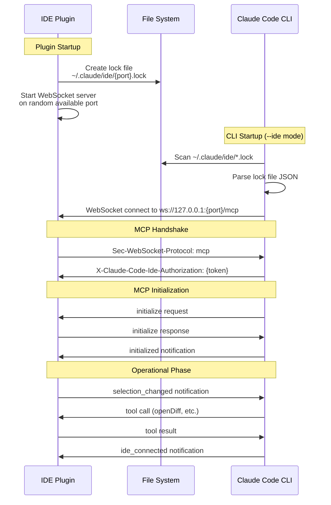
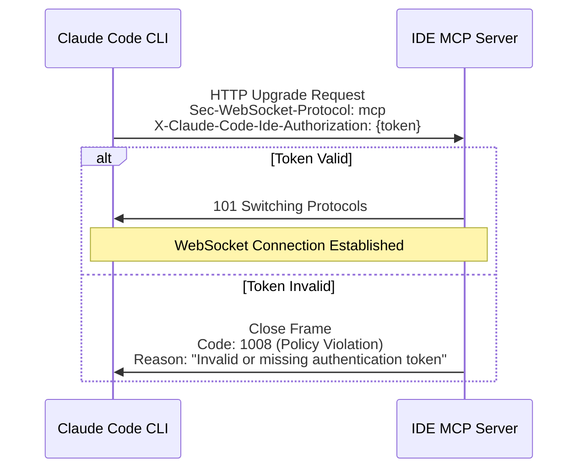
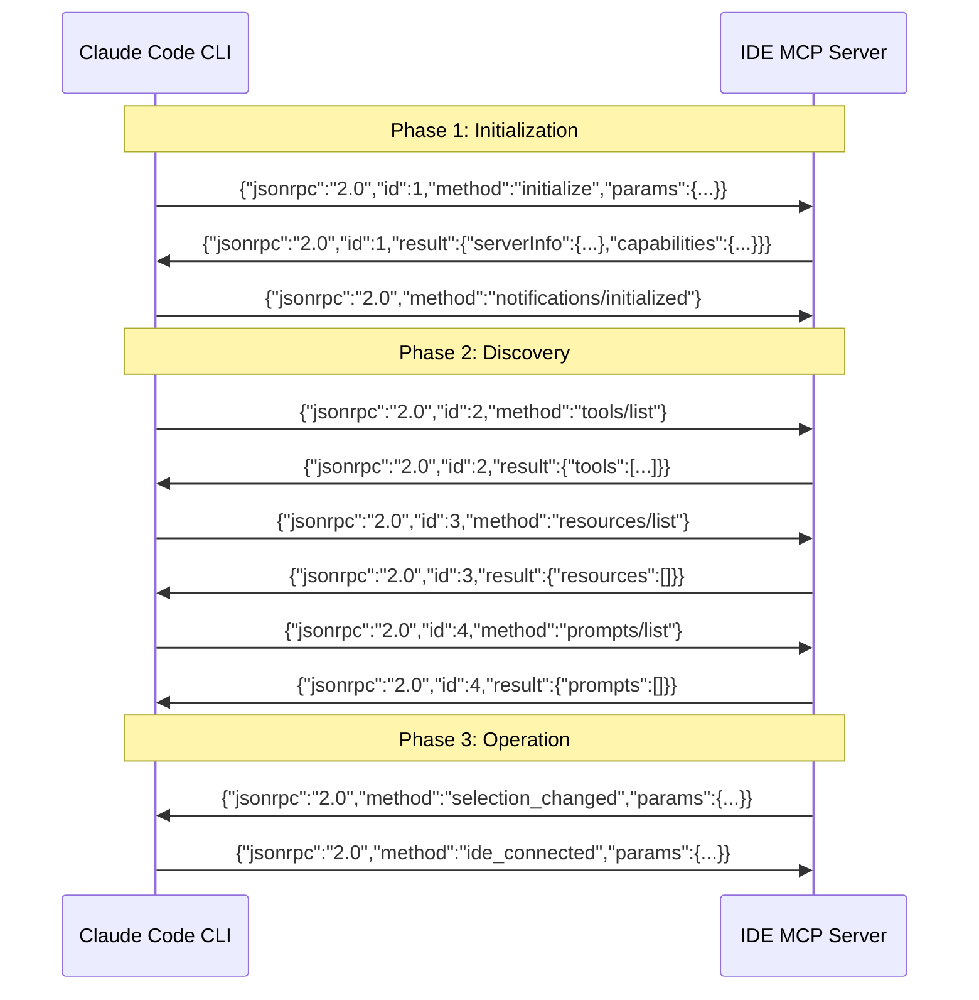
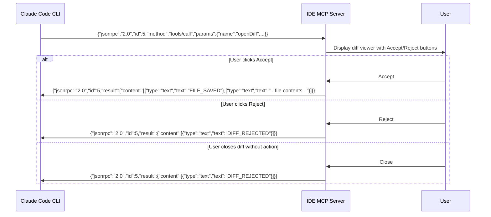
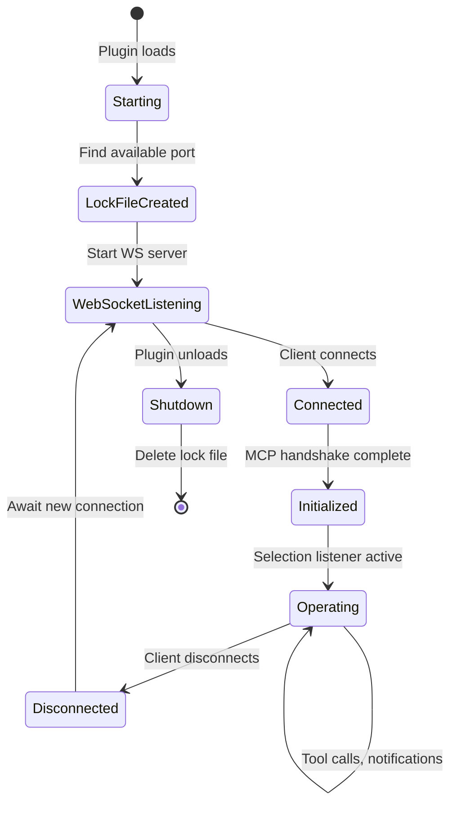
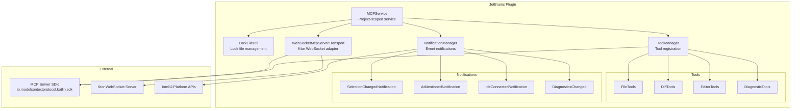
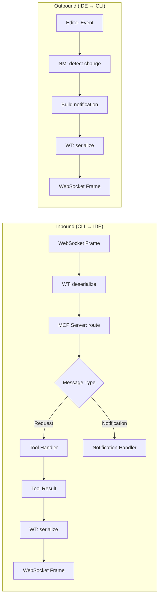

# Claude Code IDE Plugin Communication Protocol

This document provides a comprehensive reverse-engineered specification of the communication protocol used by Claude Code IDE plugins (JetBrains, VS Code, etc.) to integrate with the Claude Code CLI.

## Overview

The Claude Code IDE integration uses the **Model Context Protocol (MCP)** over **WebSocket** to enable bi-directional communication between IDE plugins and the Claude Code CLI. The architecture follows a server-client model where the IDE plugin acts as an MCP server and the Claude Code CLI connects as a client.



## Discovery Mechanism

### Lock File Location

Lock files are stored in:
```
~/.claude/ide/{port}.lock
```

The directory can be overridden by:
1. Plugin settings (`CLAUDE_CONFIG_DIR` in plugin config)
2. Environment variable: `CLAUDE_CONFIG_DIR`

### Lock File Format

```json
{
  "workspaceFolders": ["/path/to/project1", "/path/to/project2"],
  "pid": 12345,
  "ideName": "IntelliJ IDEA",
  "transport": "ws",
  "runningInWindows": false,
  "authToken": "base64-url-encoded-64-byte-random-token"
}
```

| Field | Type | Description |
|-------|------|-------------|
| `workspaceFolders` | `string[]` | List of project/workspace paths (POSIX-style) |
| `pid` | `number` | IDE process ID |
| `ideName` | `string` | IDE name (e.g., "IntelliJ IDEA", "WebStorm", "Obsidian") |
| `transport` | `string` | Transport type, always `"ws"` for WebSocket |
| `runningInWindows` | `boolean` | Whether running on Windows |
| `authToken` | `string` | Base64 URL-encoded 64-byte random token for authentication |

## WebSocket Connection

### Endpoint

```
ws://{host}:{port}/mcp
```

- **Host**: `127.0.0.1` (default) or `0.0.0.0` if configured for all interfaces
- **Port**: Random available port (stored in lock file name)
- **Path**: `/mcp`

### Required Headers

| Header | Value |
|--------|-------|
| `Sec-WebSocket-Protocol` | `mcp` |
| `X-Claude-Code-Ide-Authorization` | `{authToken}` |

### Connection Sequence



## MCP Protocol

The protocol uses **JSON-RPC 2.0** over WebSocket text frames.

### Server Capabilities

The IDE plugin advertises these capabilities:

```json
{
  "serverInfo": {
    "name": "Claude Code JetBrains Plugin",
    "version": "X.Y.Z"
  },
  "capabilities": {
    "tools": {
      "listChanged": true
    }
  }
}
```

### Initialization Sequence



## Notifications (Server → Client)

Notifications are one-way messages from the IDE to Claude Code (no response expected).

### 1. `selection_changed`

Sent when the user's cursor position or text selection changes in the editor.

```json
{
  "jsonrpc": "2.0",
  "method": "selection_changed",
  "params": {
    "selection": {
      "start": { "line": 10, "character": 5 },
      "end": { "line": 15, "character": 20 }
    },
    "text": "selected text content",
    "filePath": "/path/to/file.ts"
  }
}
```

| Field | Type | Description |
|-------|------|-------------|
| `selection` | `CodeRange` | Start and end cursor positions (0-based) |
| `text` | `string?` | Selected text (null if no selection) |
| `filePath` | `string?` | POSIX-style file path (null if no file open) |

**CursorPosition Schema:**
```typescript
interface CursorPosition {
  line: number;      // 0-based line number
  character: number; // 0-based column number
}

interface CodeRange {
  start: CursorPosition;
  end: CursorPosition;
}
```

### 2. `at_mentioned`

Sent when the user triggers an "@ mention" action (e.g., via Send to Claude action).

```json
{
  "jsonrpc": "2.0",
  "method": "at_mentioned",
  "params": {
    "filePath": "/path/to/file.ts",
    "lineStart": 10,
    "lineEnd": 20
  }
}
```

| Field | Type | Description |
|-------|------|-------------|
| `filePath` | `string` | POSIX-style file path (required) |
| `lineStart` | `number?` | Start line (0-based, null for whole file) |
| `lineEnd` | `number?` | End line (0-based, null for whole file) |

### 3. `diagnostics_changed`

Sent when diagnostics (errors, warnings) change for a file.

```json
{
  "jsonrpc": "2.0",
  "method": "diagnostics_changed",
  "params": {
    "uri": "file:///path/to/file.ts",
    "diagnostics": []
  }
}
```

## Notifications (Client → Server)

### `ide_connected`

Sent by Claude Code CLI after successful initialization.

```json
{
  "jsonrpc": "2.0",
  "method": "ide_connected",
  "params": {
    "pid": 54321,
    "isPluginVersionUnsupported": false
  }
}
```

| Field | Type | Description |
|-------|------|-------------|
| `pid` | `number` | Claude Code CLI process ID |
| `isPluginVersionUnsupported` | `boolean` | Whether the plugin version is too old |

## Tools (Client → Server)

Tools are remote procedures that Claude Code can call on the IDE.

### Tool Discovery

The IDE advertises available tools via `tools/list`:

```json
{
  "jsonrpc": "2.0",
  "id": 2,
  "result": {
    "tools": [
      {
        "name": "openDiff",
        "description": "Opens a diff in the IDE",
        "inputSchema": { ... }
      },
      {
        "name": "openFile",
        "description": "Opens the specified file in the IDE",
        "inputSchema": { ... }
      }
    ]
  }
}
```

### Tool Call Flow



### Available Tools

#### 1. `openDiff`

Opens a diff viewer showing proposed changes.

**Input Schema:**
```typescript
interface OpenDiffToolArgs {
  old_file_path: string;    // Absolute path to original file
  new_file_contents: string; // Proposed new file contents
  tab_name: string;          // Tab title for the diff viewer
}
```

**Response:**
- `["FILE_SAVED", "<updated file contents>"]` - User accepted changes
- `["DIFF_REJECTED"]` - User rejected changes

#### 2. `openFile`

Opens a file in the IDE.

**Input Schema:**
```typescript
interface OpenFileArgs {
  filePath: string;      // Absolute file path (POSIX-style)
  makeFrontmost: boolean; // Whether to bring file to front
}
```

**Response:**
- `["OK"]` - File opened successfully
- `["Project is closed or directory not found"]` - Error

#### 3. `open_files`

Opens multiple files in the IDE.

**Input Schema:**
```typescript
interface OpenFilesInEditorArgs {
  file_paths: string[]; // Array of absolute file paths (POSIX-style)
}
```

**Response:**
```json
{
  "opened_files": ["/path/to/file1.ts", "/path/to/file2.ts"]
}
```

#### 4. `close_tab`

Closes a tab by name or file path.

**Input Schema:**
```typescript
interface CloseTabToolArgs {
  tab_name: string; // Tab name (from openDiff) or absolute file path
}
```

**Response:**
- `["OK"]` - Tab closed
- `["Tab not found"]` - Tab not found

#### 5. `get_all_opened_file_paths`

Gets all currently open file paths.

**Input Schema:** None (empty object)

**Response:**
```
/path/to/file1.ts
/path/to/file2.ts
```
(Newline-separated list of absolute paths)

#### 6. `reformat_file`

Reformats a file using IDE's code formatter.

**Input Schema:**
```typescript
interface ReformatFileArgs {
  file_path: string; // Absolute file path (POSIX-style)
}
```

**Response:**
- `["OK"]` - File reformatted
- `["File not found"]` - File not found

#### 7. `getDiagnostics`

Gets diagnostic information (errors, warnings) for a file.

**Input Schema:**
```typescript
interface GetDiagnosticsArgs {
  uri?: string; // File URI (file:///...), null for current file
}
```

**Response:**
```json
[{
  "uri": "file:///path/to/file.ts",
  "diagnostics": [
    {
      "message": "Property 'foo' does not exist",
      "severity": "ERROR",
      "range": {
        "start": { "line": 10, "character": 5 },
        "end": { "line": 10, "character": 8 }
      }
    }
  ]
}]
```

**Severity Values:** `ERROR`, `WARNING`, `WEAK_WARNING`, `INFO`

## Connection Lifecycle



### Keepalive / Health Check

The IDE server sends periodic `ping` requests (every 5 seconds) to verify client connectivity:

```json
// Request
{"jsonrpc":"2.0","id":100,"method":"ping"}

// Response
{"jsonrpc":"2.0","id":100,"result":{}}
```

If ping fails (3 second timeout), the connection is considered dead and cleaned up.

## Error Handling

### JSON-RPC Errors

For unknown methods:
```json
{
  "jsonrpc": "2.0",
  "id": 5,
  "error": {
    "code": -32601,
    "message": "Method not found"
  }
}
```

### Tool Errors

Tool errors are returned as results with error flag:
```json
{
  "jsonrpc": "2.0",
  "id": 5,
  "result": {
    "content": [{"type": "text", "text": "Error message"}],
    "isError": true
  }
}
```

## Path Handling

### Path Normalization

All paths exchanged between IDE and CLI use **POSIX-style** forward slashes (`/`):

- Windows: `C:\Users\foo\project` → `/c/Users/foo/project`
- macOS/Linux: `/Users/foo/project` (unchanged)

### URI Format

For `getDiagnostics` and similar tools:
- `file:///path/to/file.ts` (Unix)
- `file:///c:/Users/foo/file.ts` (Windows)

## Implementation Notes

### Authentication Token Generation

```kotlin
val secureRandom = SecureRandom()
val bytes = ByteArray(64)
secureRandom.nextBytes(bytes)
val authToken = Base64.getUrlEncoder().withoutPadding().encodeToString(bytes)
```

### Port Selection

```kotlin
val socket = ServerSocket(0) // OS assigns available port
val port = socket.localPort
socket.close()
```

### WebSocket Subprotocol

The server validates that the client requests the `mcp` subprotocol:
```kotlin
val subprotocol = request.headers["Sec-WebSocket-Protocol"]
if (subprotocol != "mcp") {
    throw IllegalStateException("Invalid subprotocol: $subprotocol, expected mcp")
}
```

## Security Considerations

1. **Token-based Authentication**: Each IDE instance generates a unique 64-byte random token
2. **Local-only by Default**: Server binds to `127.0.0.1` unless explicitly configured otherwise
3. **Lock File Permissions**: Lock files should have restrictive permissions (user-only read/write)
4. **Process Validation**: The `pid` field allows Claude Code to verify the IDE process is still running

## Compatibility Matrix

| IDE | Plugin Version | MCP Version | Features |
|-----|---------------|-------------|----------|
| IntelliJ IDEA | 0.x | 1.0 | Full |
| VS Code | 0.x | 1.0 | Full |
| Obsidian (vault-code) | 0.x | 1.0 | Context only |

## Component Architecture (JetBrains Implementation)

The JetBrains plugin uses a layered architecture:



### Key Classes

| Class | Responsibility |
|-------|---------------|
| `MCPService` | Project-scoped service managing the MCP server lifecycle |
| `LockFileUtil` | Creates/deletes lock files, generates auth tokens |
| `WebSocketMcpServerTransport` | Bridges Ktor WebSocket to MCP transport interface |
| `ToolManager` | Registers all IDE tools with the MCP server |
| `NotificationManager` | Handles editor events and sends notifications |

### Message Flow



## Minimal Implementation Checklist

For a basic IDE integration (context-only, no tools):

1. **Lock File Creation**
   - [ ] Generate 64-byte random token (Base64 URL-encoded)
   - [ ] Find available port via `ServerSocket(0)`
   - [ ] Write JSON lock file to `~/.claude/ide/{port}.lock`
   - [ ] Delete lock file on plugin unload

2. **WebSocket Server**
   - [ ] Listen on `ws://127.0.0.1:{port}/mcp`
   - [ ] Validate `Sec-WebSocket-Protocol: mcp` header
   - [ ] Validate `X-Claude-Code-Ide-Authorization` header
   - [ ] Handle text frames with JSON-RPC messages

3. **MCP Handshake**
   - [ ] Respond to `initialize` with server info and capabilities
   - [ ] Acknowledge `notifications/initialized`
   - [ ] Respond to `tools/list` with empty array `[]`
   - [ ] Respond to `resources/list` with empty array `[]`
   - [ ] Respond to `prompts/list` with empty array `[]`

4. **Context Notifications**
   - [ ] Track editor selection changes
   - [ ] Send `selection_changed` with file path, range, and selected text
   - [ ] Handle `ide_connected` notification from CLI

## Sample Lock File

```json
{
  "workspaceFolders": ["/Users/dev/my-project"],
  "pid": 12345,
  "ideName": "My Custom IDE",
  "transport": "ws",
  "runningInWindows": false,
  "authToken": "VGhpcyBpcyBhIHNhbXBsZSB0b2tlbiBmb3IgZGVtb25zdHJhdGlvbiBwdXJwb3Nlcw"
}
```

## Sample MCP Exchange

### Initialize Request (CLI → IDE)
```json
{
  "jsonrpc": "2.0",
  "id": 1,
  "method": "initialize",
  "params": {
    "protocolVersion": "2024-11-05",
    "clientInfo": {
      "name": "claude-code",
      "version": "1.0.0"
    },
    "capabilities": {}
  }
}
```

### Initialize Response (IDE → CLI)
```json
{
  "jsonrpc": "2.0",
  "id": 1,
  "result": {
    "protocolVersion": "2024-11-05",
    "serverInfo": {
      "name": "My Custom IDE Plugin",
      "version": "0.1.0"
    },
    "capabilities": {
      "tools": {
        "listChanged": true
      }
    }
  }
}
```

### Selection Changed Notification (IDE → CLI)
```json
{
  "jsonrpc": "2.0",
  "method": "selection_changed",
  "params": {
    "selection": {
      "start": { "line": 10, "character": 0 },
      "end": { "line": 15, "character": 25 }
    },
    "text": "const foo = bar();",
    "filePath": "/Users/dev/my-project/src/main.ts"
  }
}
```

## References

- [Model Context Protocol Specification](https://modelcontextprotocol.io/specification)
- [JSON-RPC 2.0 Specification](https://www.jsonrpc.org/specification)
- [WebSocket Protocol (RFC 6455)](https://tools.ietf.org/html/rfc6455)
